# CKAD Note Section 9 Updates for Sep 2021 Changes

<br>

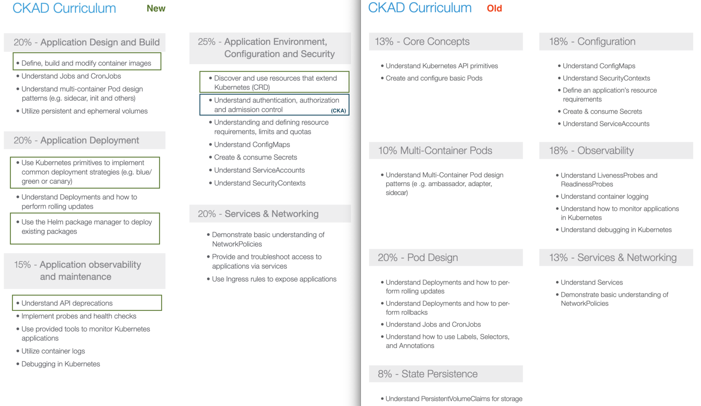

▲ CKAD 新舊版差異

<br>

## 119. Define, build and modify container images

<br>

非常基礎的 Docker Image (container image) 介紹，我之前就打過一篇在公司 Bookstack 了~\
《Docker Image 介紹》

<br>

## 121. Authentication, Authorization and Admission Control

<br>

除了 master,worker node 本身的安全機制 (例如: SSH public key ONLY) 以外\
`kube-apiserver` 在 K8s cluster 當中扮演非常關鍵的角色必須要被嚴格控管，接下來的章節會介紹 How to\
一開始我們先來探討一下 **Who can access?** 與 **What can they do?**

<br>

### Who can access?


<br>

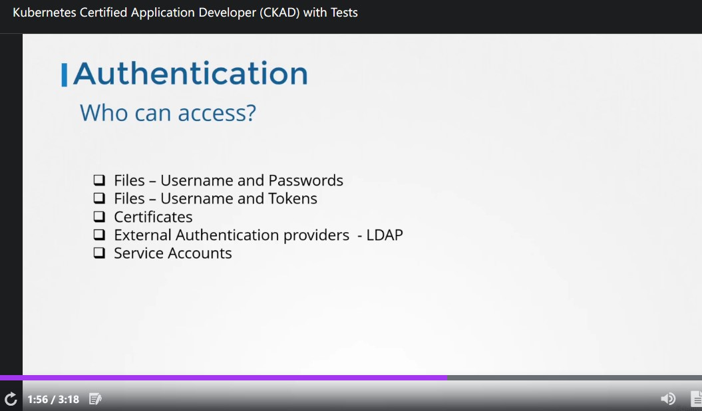


- Files - username and passwds
- Files - username and tokens
- Certification
- 外部授權平台 (例如: LDAP)
- Service Account

<br>

### What can they do?


~~其實我不知道中文怎麼翻.. What can they do ??~~  總之看起來像 K8s 的授權 (Authorization) 控管方式:


- RBAC Authorization. (Role Base Access Control)
- ABAC Authorization. (Attribute Base Access Control)
- Webhook Mode

<br>


▲ K8s cluster 內各個元件在溝通時都透過 TLS 加密

<br>

## 122. Authentication

<br>

本章節的重點會放在三種不同 user 如何透過 Authentication 機制安全的訪問 K8s cluster


- K8s cluster admin
- Developer
- ~~End User~~ (在這邊被移除，講師認為 sercurity 責任應該在 app 本身)
- Bots (service account)

<br>

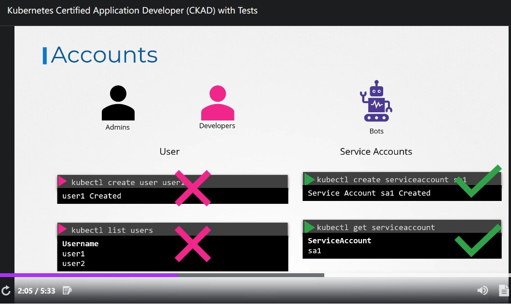

▲ Kubernetes cluster 原始狀態並沒有提供使用者的功能

<br>

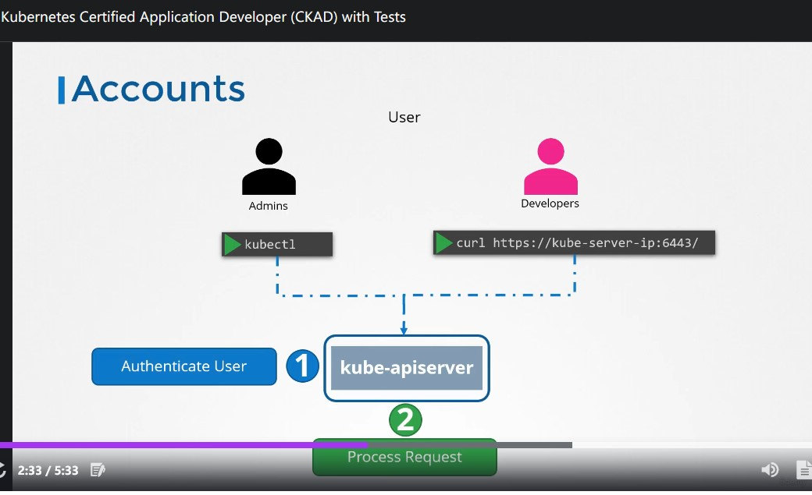

▲ 不管是透過 `kubectl` 或者 `curl` (不知道是不是就是在說 Dashboard) 都要找 `kube-apiserver`。首先會 (1) Authenticate Users (2) Process request。

<br>

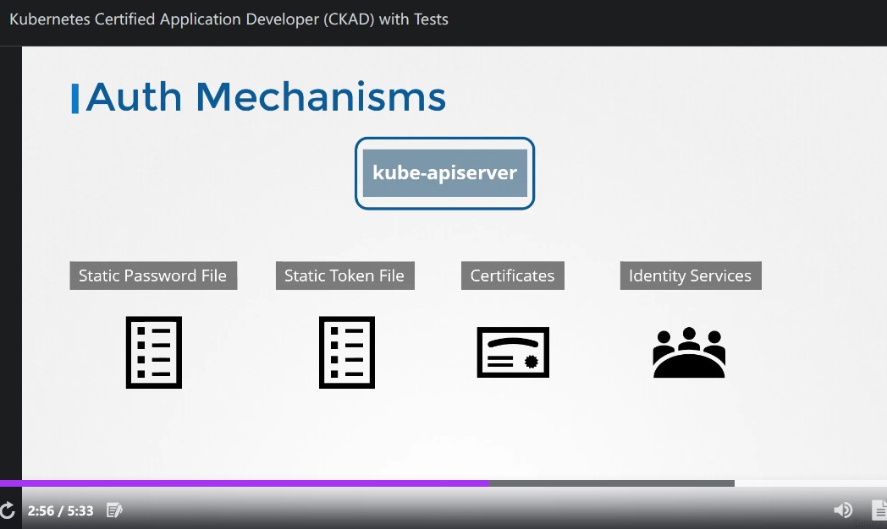

驗證 (authentication) 的方式有這些:

- Static Password File
- Static Token File
- Certificates
- External service (EX: LDAP)

<br>

### File

前兩項都是以 file 的形式去給定使用者帳號跟密碼。 **<span style='color:red'>兩種都不建議使用</span>**


```csv
## <passwd>,<username>,<user_id>,<group_name>
password123,user1,u0001
```

<br>

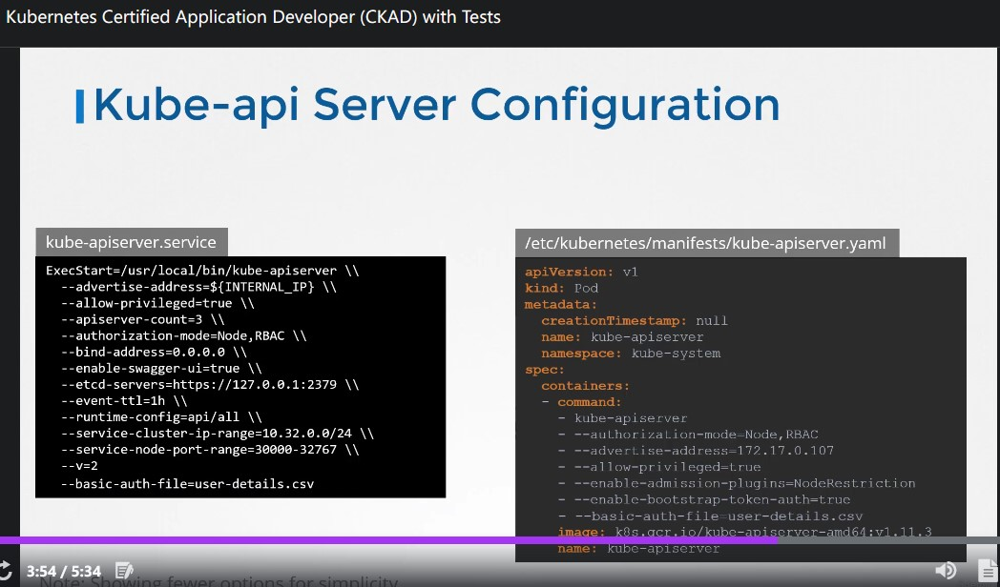

▲ 然後在啟動 `kube-apiserver` 的時候傳進去

<br>

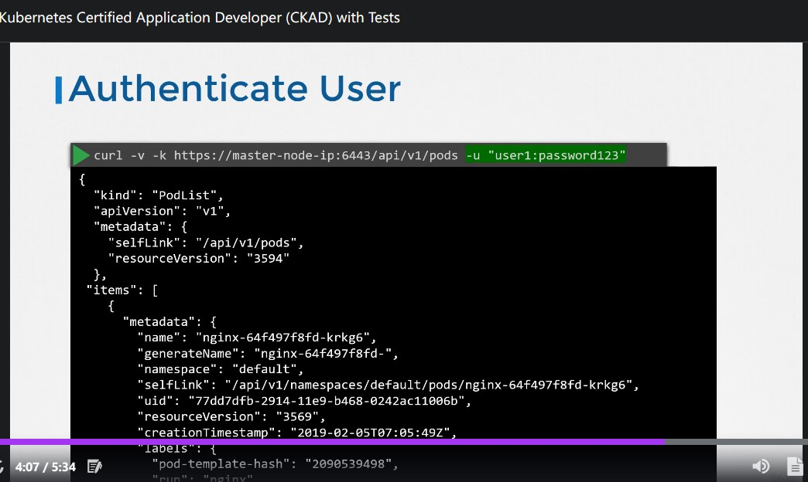

▲ `curl` 搭配 user/passwd 的認證方式

<br>

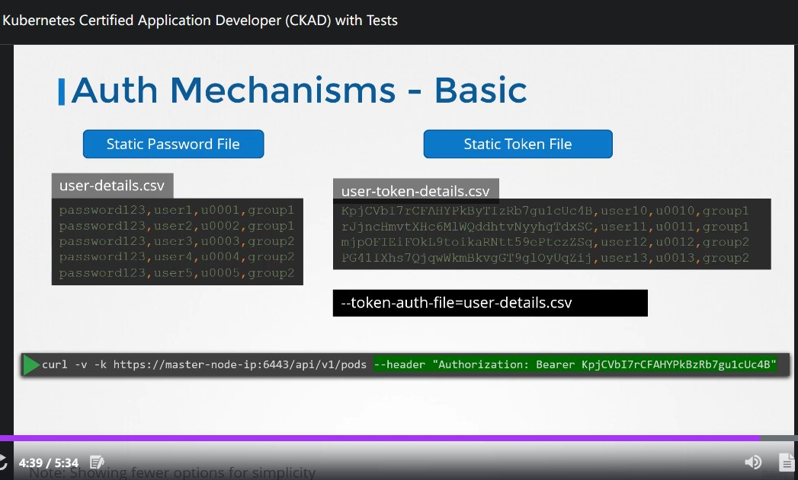

▲ `token` 的部分

<br>

## 123. KubeConfig

<br>

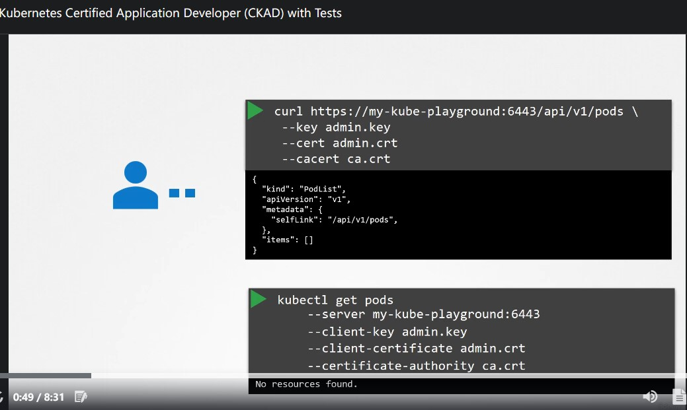

▲ 正常來說，透過 `kubectl` 或者 `curl` 來取得 `pod` 的資訊，指令應該長這樣。\
**<span style='color:blue'>因為使用起來太麻煩了，我們會把這些資訊放在 KubeConfig file  (`$HOME/.kube/config`) 裡面</span>**

<br>

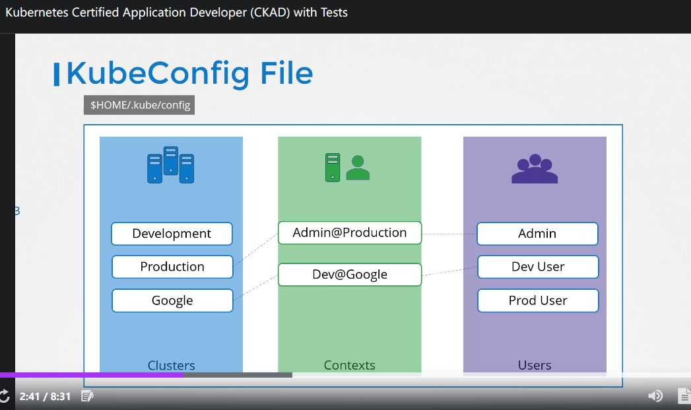

▲ config file 裡面包含三個東西: `Cluster`, `Context`, `Users`。而 `Context` 就是串連 `Cluster` 與 `User` 的東西。\
其實這東西在前面章節的 LAB 就應該要接觸到了 (我記得我的筆記也有打) `kubectl config set-context --current --namespace=` 有印象了吧!

<br>

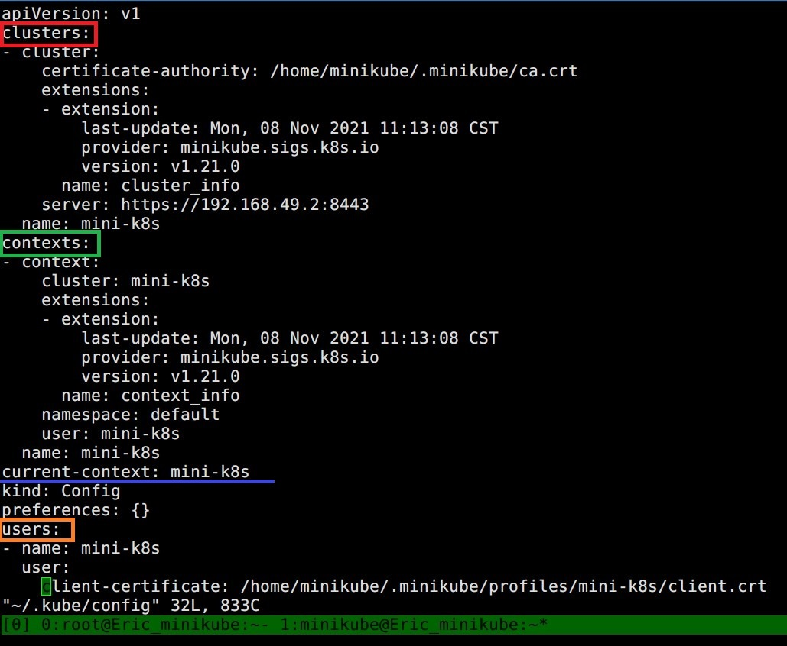

▲ config file 內容是 `YAML` 檔

<br>

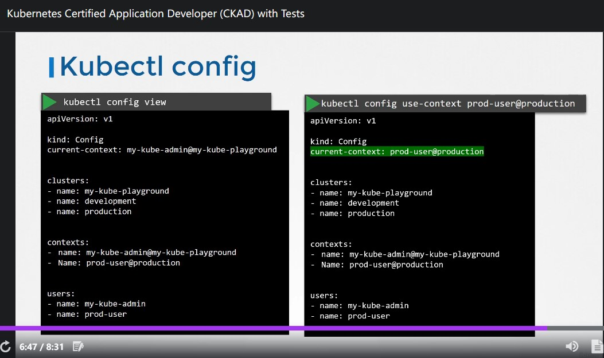

▲ 使用 `kubectl config use-context <context_name>` 來切換。

<br>

## 125. API Groups

<br>

一直以來 `kubectl` 都是在跟 `api-server` 互動，這個章節要講的是 API Groups。\
接下來的動作會需要使用 `curl` 跟 `api-server` 互動，達成這個需求最簡單的方式就是使用 `kubectl proxy` 在 localhost 幫我們扮演一個 reverse proxy 的角色，這樣一來就能很簡單的使用 `curl` 不會複雜!


[Access Clusters Using the Kubernetes API](https://kubernetes.io/docs/tasks/administer-cluster/access-cluster-api/)


```bash
## run proxy in bg
kubectl proxy --port=8080 &

## bg -> fg
fg

## show bg jobs
jobs
```


```bash
curl http://localhost:8080/api/
```

<br>

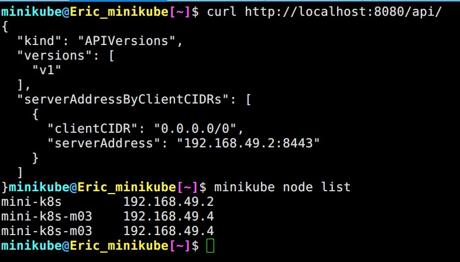

▲ 列出 `api-server` 的 IP address

<br>

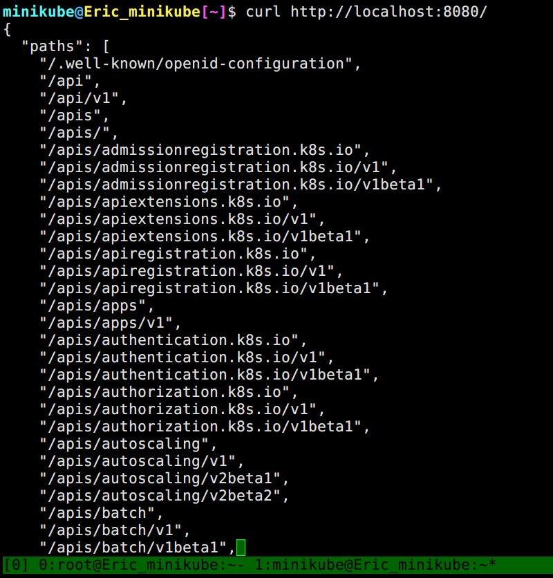

▲ 列出所有選項

<br>

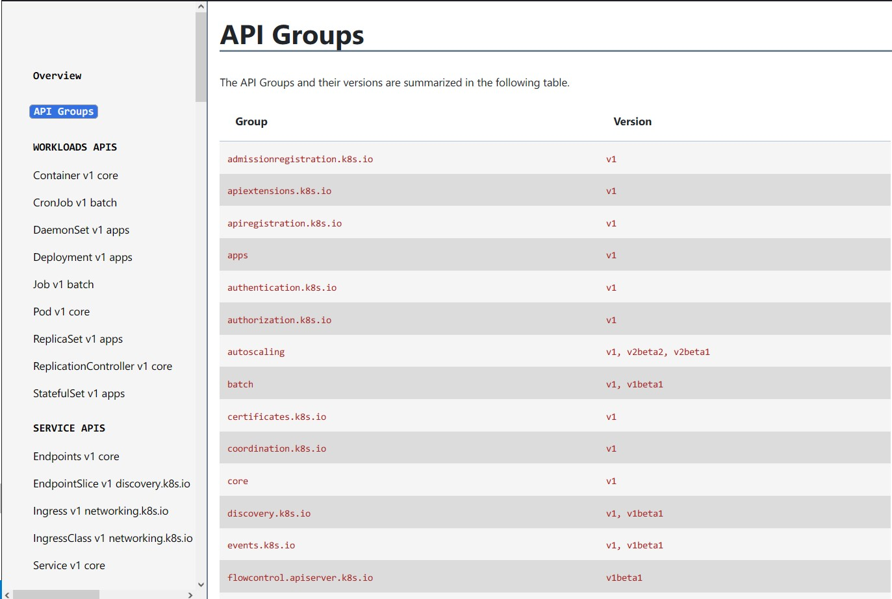

▲ 一頁式 `api` page 能夠很清楚的知道各個 K8s Object 屬於哪個 API Group

<br>

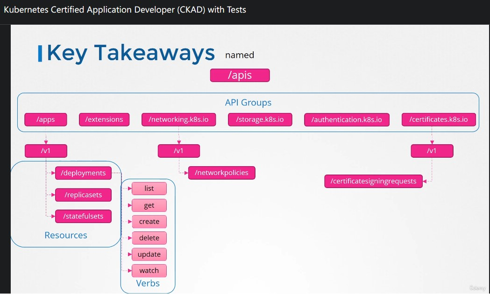

▲ 每個 `Resources` 底下的都有 `Verbs` (動作)

<br>

