# CKAD Note Section 9 Updates for Sep 2021 Changes

<br>


▲ CKAD 新舊版差異

<br>

## 119. Define, build and modify container images

<br>

非常基礎的 Docker Image (container image) 介紹，我之前就打過一篇在公司 Bookstack 了~\
《Docker Image 介紹》

<br>

## 121. Authentication, Authorization and Admission Control

<br>

除了 master,worker node 本身的安全機制 (例如: SSH public key ONLY) 以外\
`kube-apiserver` 在 K8s cluster 當中扮演非常關鍵的角色必須要被嚴格控管，接下來的章節會介紹 How to\
一開始我們先來探討一下 **Who can access?** 與 **What can they do?**

<br>

### Who can access?


<br>


- Files - username and passwds
- Files - username and tokens
- Certification
- 外部授權平台 (例如: LDAP)
- Service Account

<br>

### What can they do?


~~其實我不知道中文怎麼翻.. What can they do ??~~  總之看起來像 K8s 的授權 (Authorization) 控管方式:


- RBAC Authorization. (Role Base Access Control)
- ABAC Authorization. (Attribute Base Access Control)
- Webhook Mode

<br>


▲ K8s cluster 內各個元件在溝通時都透過 TLS 加密

<br>

## 122. Authentication

<br>

本章節的重點會放在三種不同 user 如何透過 Authentication 機制安全的訪問 K8s cluster


- K8s cluster admin
- Developer
- ~~End User~~ (在這邊被移除，講師認為 sercurity 責任應該在 app 本身)
- Bots (service account)

<br>


▲ Kubernetes cluster 原始狀態並沒有提供使用者的功能

<br>


▲ 不管是透過 `kubectl` 或者 `curl` (不知道是不是就是在說 Dashboard) 都要找 `kube-apiserver`。首先會 (1) Authenticate Users (2) Process request。

<br>


驗證 (authentication) 的方式有這些:

- Static Password File
- Static Token File
- Certificates
- External service (EX: LDAP)

<br>

### File

前兩項都是以 file 的形式去給定使用者帳號跟密碼。 **<span style='color:red'>兩種都不建議使用</span>**


```csv
## <passwd>,<username>,<user_id>,<group_name>
password123,user1,u0001
```

<br>


▲ 然後在啟動 `kube-apiserver` 的時候傳進去

<br>


▲ `curl` 搭配 user/passwd 的認證方式

<br>


▲ `token` 的部分

<br>

## 123. KubeConfig

<br>


▲ 正常來說，透過 `kubectl` 或者 `curl` 來取得 `pod` 的資訊，指令應該長這樣。\
**<span style='color:blue'>因為使用起來太麻煩了，我們會把這些資訊放在 KubeConfig file  (`$HOME/.kube/config`) 裡面</span>**

<br>


▲ config file 裡面包含三個東西: `Cluster`, `Context`, `Users`。而 `Context` 就是串連 `Cluster` 與 `User` 的東西。\
其實這東西在前面章節的 LAB 就應該要接觸到了 (我記得我的筆記也有打) `kubectl config set-context --current --namespace=` 有印象了吧!

<br>


▲ config file 內容是 `YAML` 檔

<br>


▲ 使用 `kubectl config use-context <context_name>` 來切換。

<br>

## 125. API Groups

<br>

一直以來 `kubectl` 都是在跟 `api-server` 互動，這個章節要講的是 API Groups。\
接下來的動作會需要使用 `curl` 跟 `api-server` 互動，達成這個需求最簡單的方式就是使用 `kubectl proxy` 在 localhost 幫我們扮演一個 reverse proxy 的角色，這樣一來就能很簡單的使用 `curl` 不會複雜!


[Access Clusters Using the Kubernetes API](https://kubernetes.io/docs/tasks/administer-cluster/access-cluster-api/)


```bash
## run proxy in bg
kubectl proxy --port=8080 &

## bg -> fg
fg

## show bg jobs
jobs
```


```bash
curl http://localhost:8080/api/
```

<br>


▲ 列出 `api-server` 的 IP address

<br>


▲ 列出所有選項

<br>


▲ 一頁式 `api` page 能夠很清楚的知道各個 K8s Object 屬於哪個 API Group

<br>


▲ 每個 `Resources` 底下的都有 `Verbs` (動作)

<br>

## 126. Authorization

<br>


▲ 本章節目的很簡單，**權限區分**。根據不同使用者給予不同權限

<br>

### Authorization Mode 列表如下:


- AlwaysAllow
- Node
- ABAC
- RBAC
- WebHook
- AlwaysDeny

<br>

#### Node Authorizer


Node Authorizer 是專門給 worker node 與 `api-server` 之間溝通使用。

<br>


▲ `kubelet` 必須在 `SYSTEM:NODES` group 裡面 (使用 certification)。

<br>

#### ABAC Authorizer


全名: Attribute Base Access Control\
針對每個 user 設定權限 (1:1 關係)

<br>


▲ 每一次 新增/刪除 都需要重啟 `api-server`。很麻煩，所以有了 RBAC

<br>

#### RBAC Authorizer


全名: Role Base Access Control

<br>


<br>

#### WebHook Authorizer


<br>


▲ 其實不難懂，就是透過 webhook 去請外部 server 授權

<br>


▲ `api-server` 預設使用 `AlwaysAllow`

<br>


▲ 講師建議的配置，會依序授權。授權失敗往下一個，授權成功返回。

<br>

## 127. Role Based Access Controls

<br>

建立 `Role` 的方式很簡單，只需要記住 **<span style='color:red'>`--resources=` 與 `--verb=`</span>** 即可。


```bash
kubectl create role role-test --resource=pod --verb=get --verb=list --verb=watch --dry-run=client -o yaml
```

可以看到 `pod` 自動變成 `pods` 了! 由於 `resource pod` 屬於 `core api` 所以 `.rules.apiGroups[]` 可以是空白。

```yaml
apiVersion: rbac.authorization.k8s.io/v1
kind: Role
metadata:
  creationTimestamp: null
  name: role-test
rules:
- apiGroups:
  - ""
  resources:
  - pods
  verbs:
  - get
  - list
  - watch
```

<br>


▲ 透過指定 `--resource-name` 可以指定對象。

<br>

接著我們要把 `Role` 綁到 user 身上 => rolebinding


只需要記住 **<span style='color:red'>`--role=` 與 `--user=`</span>** 即可。


```bash
kubectl create rolebinding rb-test --role=role-test --user=beta --dry-run=client -o yaml
```


```yaml
apiVersion: rbac.authorization.k8s.io/v1
kind: RoleBinding
metadata:
  creationTimestamp: null
  name: rb-test
roleRef:
  apiGroup: rbac.authorization.k8s.io
  kind: Role
  name: role-test
subjects:
- apiGroup: rbac.authorization.k8s.io
  kind: User
  name: beta
```

<br>

### 測試權限


```bash
kubectl auth can-i create pod
kubectl auth can-i delete deployment
kubectl auth can-i get service

## as user
kubectl auth can-i create pod --as=beta
kubectl auth can-i delete deployment --as=beta
kubectl auth can-i get service --as=beta

## particular namespace
kubectl auth can-i create pod --as=beta --namespace=say-my
kubectl auth can-i delete deployment --as=beta --namespace=say-my
kubectl auth can-i get service --as=beta --namespace=say-my
```

<br>

## 128. Cluster Roles

<br>


▲ 首先要先介紹 namespace **<span style='color:red'>ed</span>** 與 Cluster scope 旗下物件的差異。

<br>


▲ `kubectl api-resources --namespaced` 可以列出需要 `namespace` 的 K8s resource。\
反之 `kubectl api-resources --namespaced=false`

<br>


▲ 舉例: 使用 `clusterrole` 讓 cluster-admin 可以管理 worker-node。**<span style='color:red'>不過 clusterrole 並沒有限定 `resource` 只能是 `namespaced == false` 的物件! 當使用者使用 `clusterrole` 建立 `resource == pod` 的 RBAC 時，等於 `namespace == 所有 K8s cluster 內的 namespace`</span>。**

<br>


▲ K8s cluster 已經內建許多 `clusterrole`

<br>

## 130. Admission Controllers

<br>

前面兩個 A (Authentication, Authorization) 有點像是控制 `api-server` 的「大門」，Admission controllers 是針對進入大門之後的操作做控制。

<br>

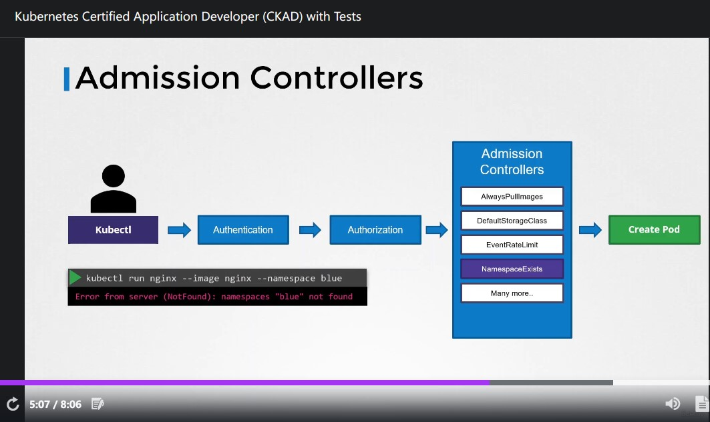

▲ 講師舉了一個預設開啟的 `NamespaceExists` 當作例子。當我們要在不存在的 `namespace == blue` 建立 `pod` 時會出現錯誤就是因為 Admission controller 當中的 `NamespaceExists == Enabled` 造成的。

<br>

使用 Minikube (docker) 的話，可以透過 `minikube ssh` 登入 control plane。接著 `docker exec -it f099fdd513e0 kube-apiserver --help | grep 'enable-admission-plugins'`\
或者使用


```bash
## PLEASE NOTICE, the pod name won't the same
kubectl exec kube-apiserver-mini-k8s -n kube-system -- kube-apiserver --help | grep 'enable-admission-plugins'
```

<br>

K8s cluster 預設開啟以下 plugin:


```man
--enable-admission-plugins strings       admission plugins that should be enabled in addition to default enabled ones (NamespaceLifecycle, LimitRanger, ServiceAccount, TaintNodesByCondition, Priority, DefaultTolerationSeconds, DefaultStorageClass, StorageObjectInUseProtection, PersistentVolumeClaimResize, RuntimeClass, CertificateApproval, CertificateSigning, CertificateSubjectRestriction, DefaultIngressClass, MutatingAdmissionWebhook, ValidatingAdmissionWebhook, ResourceQuota).
```

<br>

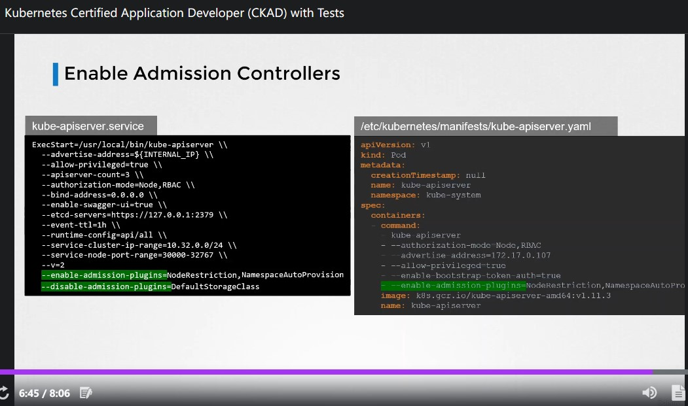

▲ 講師示範開啟 `NamespaceAutoProvision`，當 `namespace` 不存在時會自動建立。

<br>

## 132. Validating and Mutating Admission Controllers

<br>

Admission Controllers 分為兩種形式:

- Validation: 驗證
- Mutating: 自動補齊

<br>

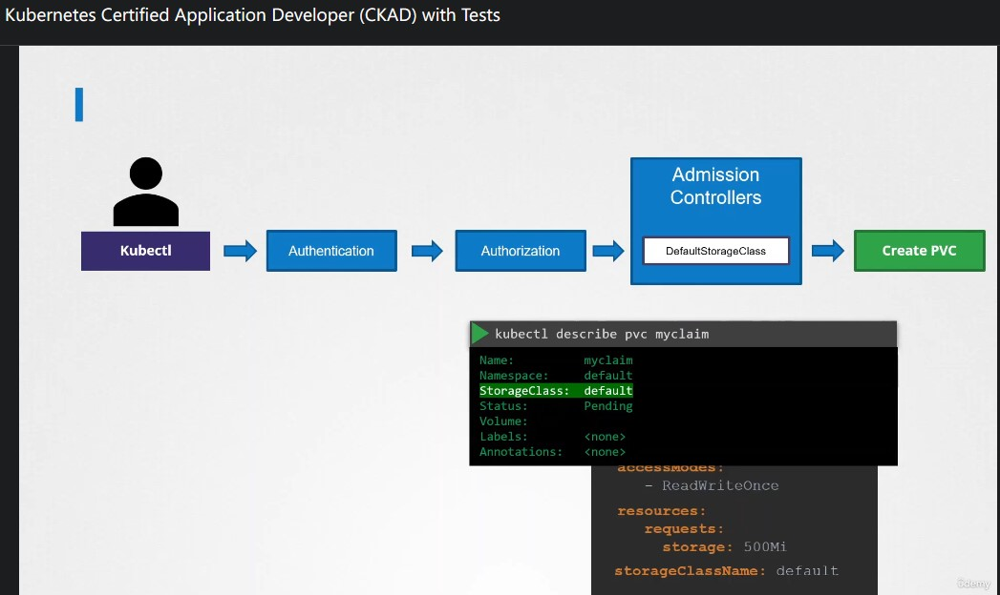

▲ Mutating (變種、變異) Admission controller 能夠自動幫我們補齊 YAML file 當中遺漏的 key-value。上圖是以漏寫 `storageClassName` 為例子。


**<span style='color:red'>一般來說 Mutating 的順序會在 Validation 前面。**

<br>

內建的用不夠 ? 沒關係，可以使用 Webhook 外包:


- MutatingAdmission Webhook
- ValidationAdmission Webhook

<br>

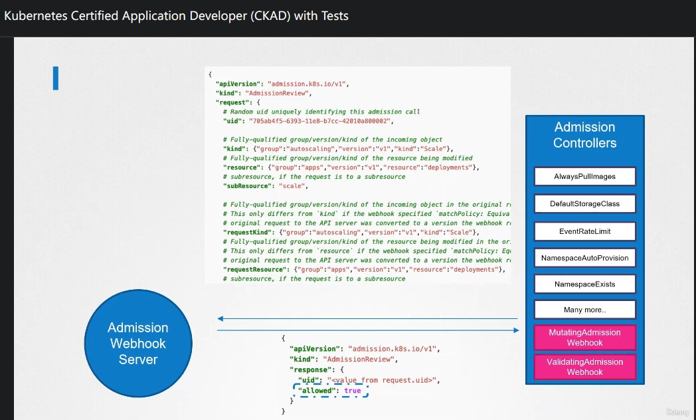

▲ 以 `JSON` format 傳送請求，外包 server 也會以 `JSON` 回應回來。

<br>

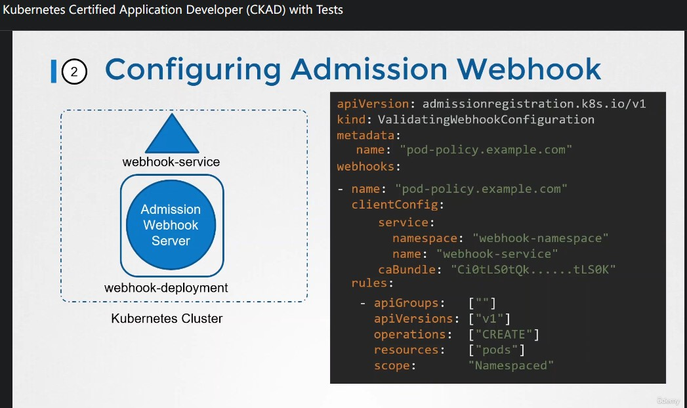

▲ webhook server 當然可以被建在 K8s cluster 裡面 (如左圖)，接著我們必須建立 `ValidatingWebhookConfiguration` 或者 `MutatingWebhookConfiguration` (如右圖)


~~乾~ 考試的時候不知道會不會這麼硬~~

<br>

**LAB Tips: 建立 TLS secret `kubectl create secret tls webhook-server-tls --cert /root/keys/webhook-server-tls.crt --key /root/keys/webhook-server-tls.key --dry-run=client -o yaml`，<span style='color:red'>記住 `--cert`, `--key`</span>**

<br>

## 134. API Versions

<br>

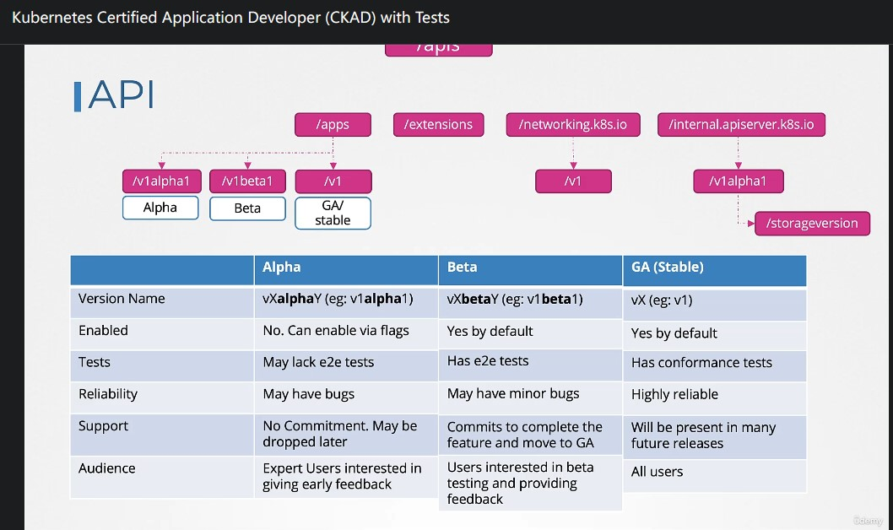

▲ 只有 **<span style='color:red'>Alpha 預設是 Disabled</span>** 的

<br>

同一個 api group 可以有很多版本，但只會有一個版本被設定成 **<span style='color:blue'>preferred</span>** 和 **<span style='color:green'>storage</span>**

<br>

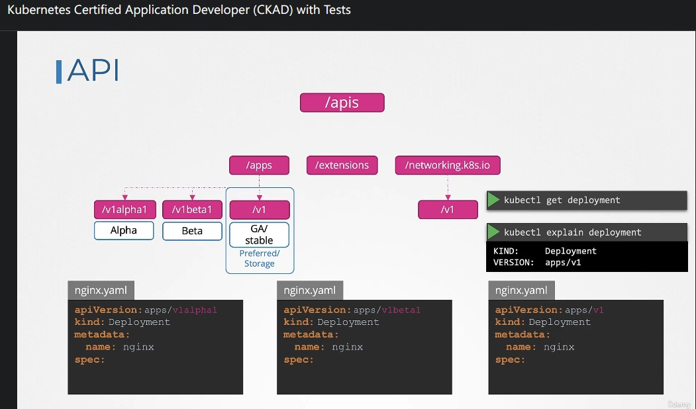

▲ 當下達 `kubectl get deployment` 或者 `kubectl explain deployment` 使用的 api version 即為 **<span style='color:blue'>preferred version。</span>**\
**<span style='color:green'>storage version</span>** 是以哪個版本儲存在 `etcd` 裡 (即使你的 YAML file 使用其他版本，都會被轉換)。

<br>

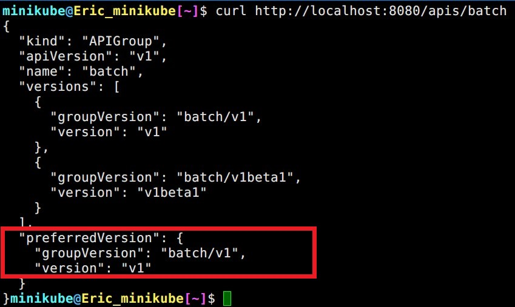

▲ 使用 `curl` 查詢 **<span style='color:blue'>preferred</span>** api version。\
**<span style='color:green'>storage version</span>** 現階段只能透過 query etcd 查詢。

<br>

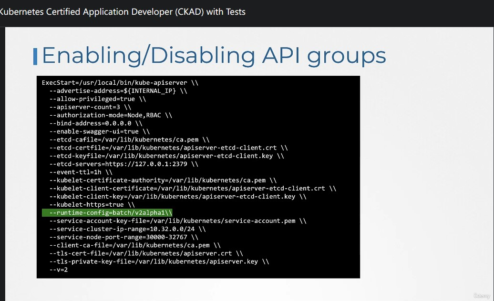

▲ 開啟 alpha version。

<br>

## 135. API Deprecations

<br>

[Kubernetes Deprecation Policy](https://kubernetes.io/docs/reference/using-api/deprecation-policy/) 這個章節在講發布 api version 的規則，有興趣的自己去翻官網吧!\
**<span style='color:blue'>本章的重點只有一個: `kubectl convert` 轉換 YAML file 使用的 api version。</span>**

<br>

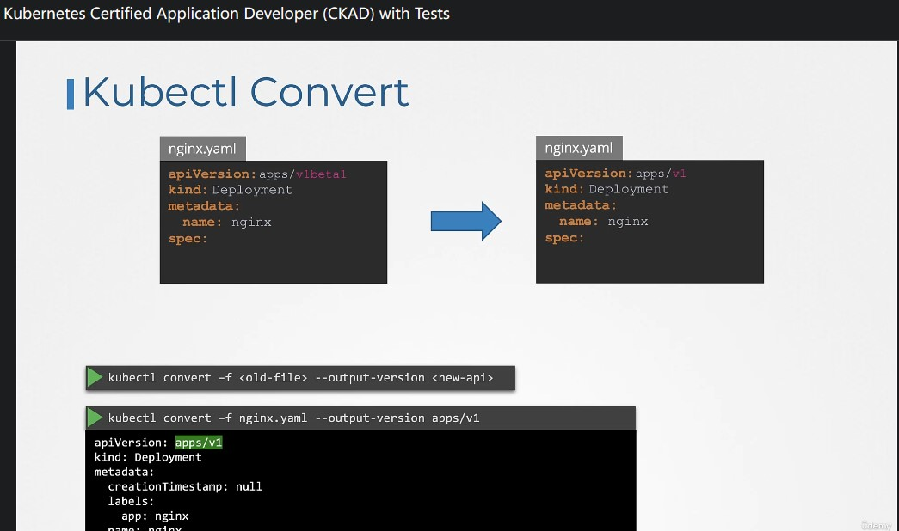

▲ 如果沒辦法使用 `kubectl convert` 的話需要安裝 plug-in。 [Install kubectl convert plugin](https://kubernetes.io/docs/tasks/tools/install-kubectl-linux/#install-kubectl-convert-plugin)

<br>

## 137. Custom Resource Definition

<br>

這個章節介紹的 `CRD` 用途是讓我們自定 Kubernetes resources (前面筆記有時候可能被我稱為 K8s 元件)。\
**<span style='color:red'>`CRD` 只是可以讓 custom resources 資訊可以被放入 `etcd` 這個 key-value database 當中</span>** 實際上要「動作」必須還要有 Controller。

<br>

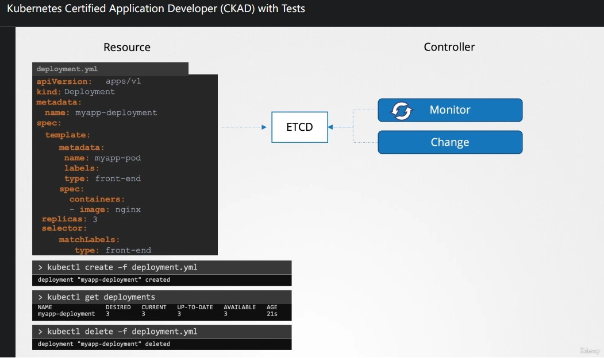

▲ controller 負責 monitorion `etcd` **然後依據變化執行動作。**

<br>

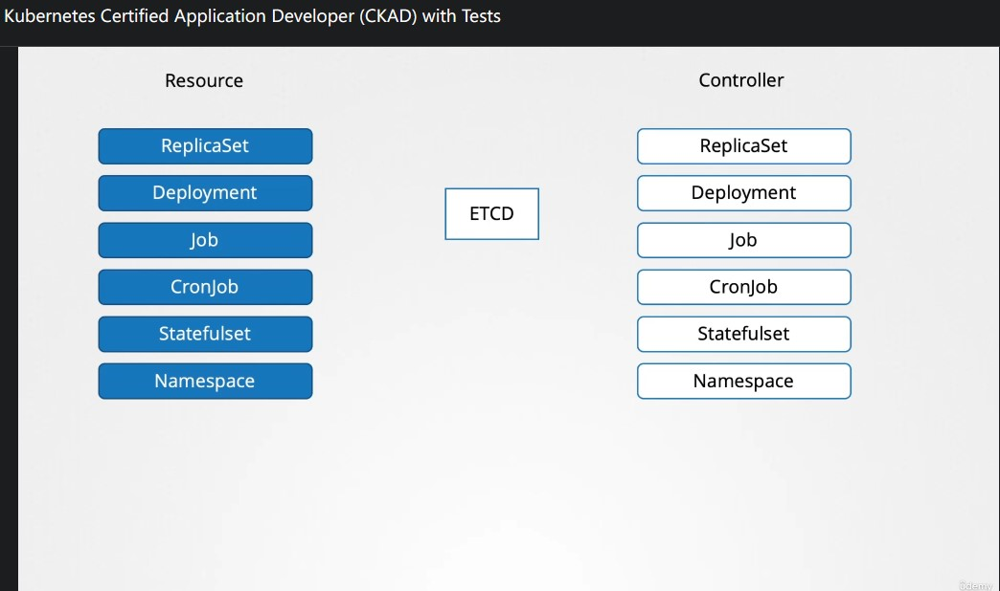

▲ 眾多 resources 與 controllers

<br>

假設今天我們想創建一個 `FlightTicket` 物件來幫我們訂機票

<br>

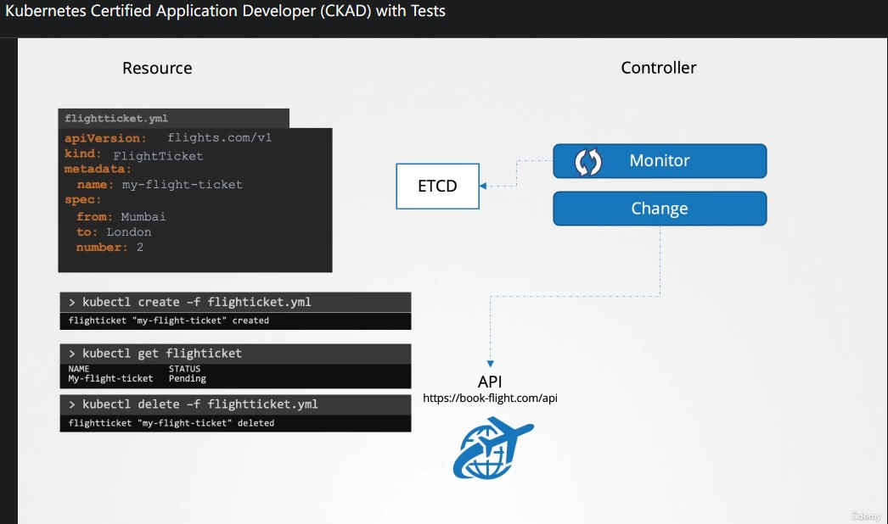

▲ ~~好久沒看到台灣廉航福利社發機票文喔~~

<br>

```yaml
apiVersion: flights.com/v1
kind: FlightTicket
metadata:
  name: my-flight-ticket
spec:
  from: TPE
  to: KIX
  number: 2
```

<br>

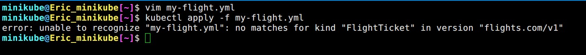

▲ 因為沒有 `CRD` 的關係，所以這個 resource 被拒絕惹

<br>

```yaml
apiVersion: apiextensions.k8s.io/v1
kind: CustomResourceDefinition
metadata:
  # name must match the spec fields below, and be in the form: <plural>.<group>
  name: flighttickets.flights.com
spec:
  # group name to use for REST API: /apis/<group>/<version>
  group: flights.com
  # list of versions supported by this CustomResourceDefinition
  versions:
    - name: v1
      # Each version can be enabled/disabled by Served flag.
      served: true
      # One and only one version must be marked as the storage version.
      storage: true
      schema:
        openAPIV3Schema:
          type: object
          properties:
            spec:
              type: object
              properties:
                from:
                  type: string
                to:
                  type: string
                number:
                  type: integer
  # either Namespaced or Cluster
  scope: Namespaced
  names:
    # plural name to be used in the URL: /apis/<group>/<version>/<plural>
    plural: flighttickets
    # singular name to be used as an alias on the CLI and for display
    singular: flightticket
    # kind is normally the CamelCased singular type. Your resource manifests use this.
    kind: FlightTicket
    # shortNames allow shorter string to match your resource on the CLI
    shortNames:
    - ft
```

<br>

~~各項上面都有註解，我就不多做解釋了~~

<br>

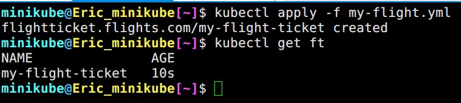

▲ 有了 `CRD` resource 就可以成功被建立!

<br>


## 138. Custom Controllers

<br>

[kubernetes/sample-controller](https://github.com/kubernetes/sample-controller) 官方提供以 Golang 撰寫的 controller 範本。

<br>

## 139. Operator Framework

<br>

> Operators are software extensions to Kubernetes that make use of custom resources to manage applications and their components. Operators follow Kubernetes principles, notably the control loop.


**<span style='color:blue'>總之 Operator Framwork 就是一個 Operator 框架 (~~在講廢話逆~~) 方便讓使用者 擴充/管理 客製化的 resources。</span>**


- [[HWChiu] Kubernetes - Operator Pattern 介紹](https://www.hwchiu.com/k8s-operator-pattern.html)
- [[講師推薦] Operatorhub.io](https://operatorhub.io/)

<br>

講師感覺就很簡單的帶過這個章節~ 單純介紹而已吧!

<br>

## 140. Deployment Strategy - Blue Green

<br>

在之前的章節有介紹過 rolling upgrade，這種部屬策略不會像 re-create 一樣把舊的 `pod` 一次全部刪除，而是 one by one 的替換，使服務不中斷。\
**Blue Green** 部屬策略則是先將新版本 部屬、測試 後，**<span style='color:red'>透過 edit `service` `selector` 的方式將流量導過去</span>**\
講完，沒了!

<br>

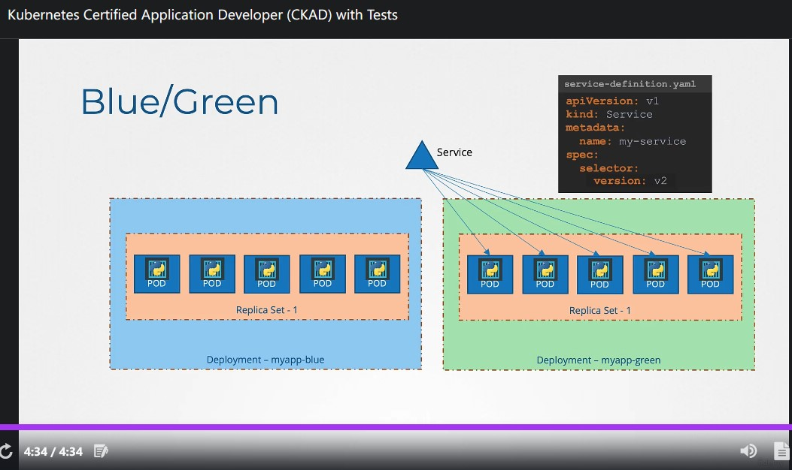

▲ Blue Green 部屬策略

<br>

## 141. Deployment Strategy - Canary

<br>

canary deployment - 金絲雀部屬，做法是將新版 app 部屬一小部分。什麼意思呢? 看圖~

<br>

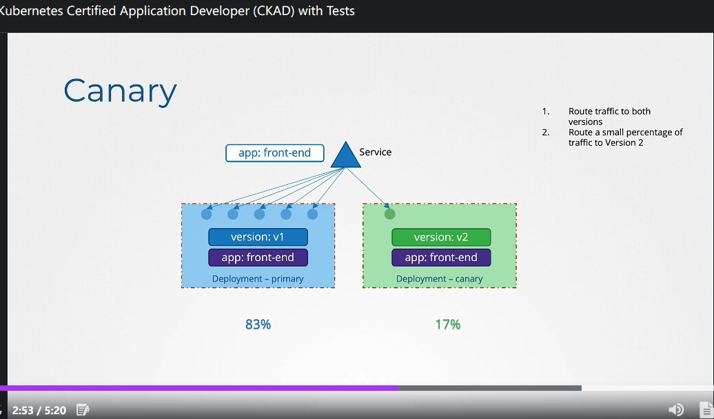

▲ canary deployemt

<br>

要解決的兩件事:

- `service` 將流量同時導到兩個 `deployment`。所以我們需要 **<span style='color:red'>在兩個 `deployment` 擁有一個相同的 label，而且 `service` `selector` 也只能有相同的部分</span>**
- 只將小部分流量導到新版。這個部分透過控制新版 `replicas` 達成 (若要精準控制百分比，需要 [Istio](https://istio.io/latest/about/service-mesh/) 或類似服務幫忙)

<br>

## 143. Helm Introduction

<br>

假設今天要透過 Kubernetes 架設 WordPress 我們需要....

- WordPress pod/deployment
- secret (儲存設定時的機敏資訊)
- Persistant Volume (PV)
- Persistant Volume Cliam (PVC)
- service (對外服務)

<br>

所需的 resources 很碎片化，可是又牽一髮動全身的感覺，各個 resoruce 環環相扣...\
部屬麻煩、客製化修改麻煩、更新麻煩，什麼都很麻煩! 所以有了 Helm 這個 **<span style='color:blue'>package manager</span>** (登楞!

<br>

Helm 一樣保有 K8s deployment 的特性，可以

```bash
helm install wordpress
helm upgrade wordpress
helm delete wordpress
```

<br>

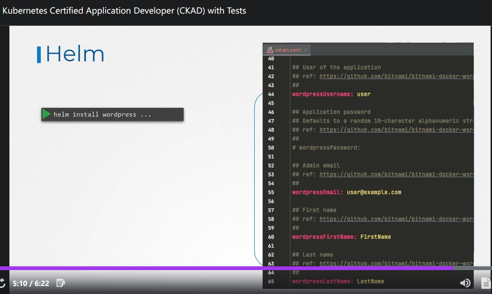

▲ Helm 設定值都在 `values.yml` 裡面了

<br>

### Install Helm


[Installing Helm](https://helm.sh/docs/intro/install/)


```bash
## bash completion
helm completion bash > /etc/bash_completion.d/helm

## sourced it right now.
source <(helm completion bash)
```

<br>

## 146. Helm Concepts

<br>

要使用 Helm 之前，必須把 Kubernetes resources YAML file 裡面的值變成變數 => **<span style='color:blue'>這個 YAML file 被稱為 Template</span>**\
使用者只須要在 `values.yaml` 設定參數即可~\
串聯打包這些東西的東西叫做 **<span style='color:red'>`Chart.yaml`</span>**


> Helm uses a packaging format called charts. A chart is a collection of files that describe a related set of Kubernetes resources.


<br>

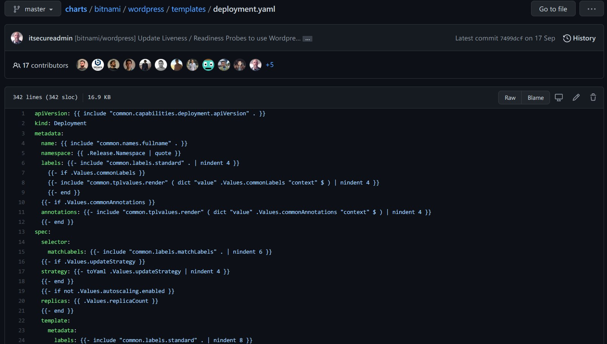

▲ 由 bitnami 出產的 WordPress Helm template。 [source](https://github.com/bitnami/charts/blob/master/bitnami/wordpress/templates/deployment.yaml)

<br>

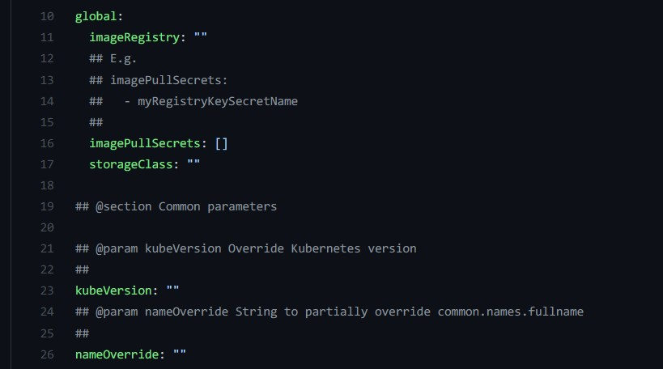

▲ 由 bitnami 出產的 WordPress Helm `values.yaml`。 [soruce](https://github.com/bitnami/charts/blob/master/bitnami/wordpress/values.yaml)

<br>

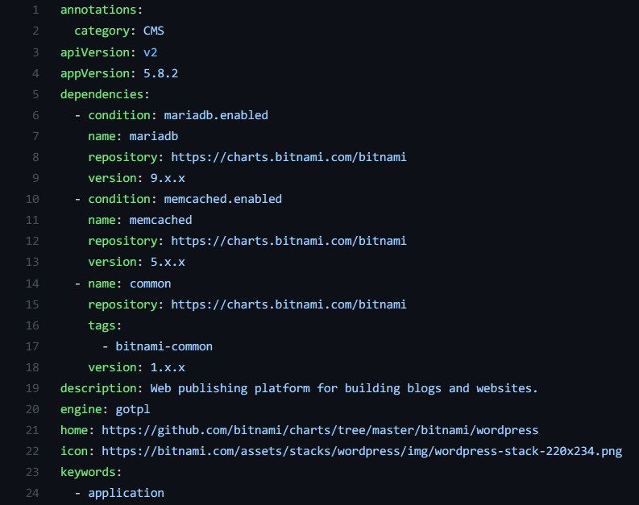

▲ 由 bitnami 出產的 WordPress Helm `Chart.yaml`。 [source](https://github.com/bitnami/charts/blob/master/bitnami/wordpress/Chart.yaml)

<br>

### Helm repo


安裝完 `helm` 預設是沒有任何 repositry 的~ 就來新增吧! bitnami 是 VMware 創立的，另外一個是開源 for CNCF 的 [ArtifactHub.io](https://artifacthub.io/) (給我的感覺是比交偏包山包海、路人甲乙都能上傳自己的 chart)


```bash
helm repo add bitnami https://charts.bitnami.com/bitnami
helm repo list
```

<br>

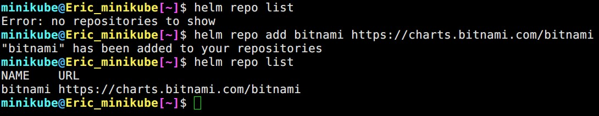

▲ 新增 `helm` repo

<br>

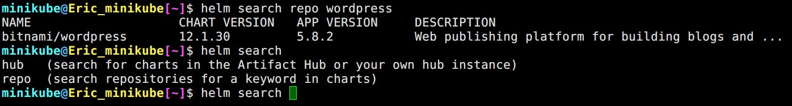

▲ 透過 `helm search repo` 使用剛剛加入的 bitnami 搜尋 package。

<br>

### How to install package


```bash
## helm install <release-name> <chart>
helm install my-release bitnami/wordpress
```

<br>

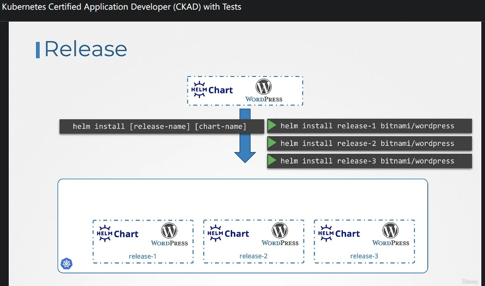

▲ 各個 `release` 各自獨立

<br>

### Helm 常用指令


```bash
## list all release
helm list

## uninstall
helm uninstall <release-name>

## just download package NOT install
helm pull --untar bitnami/nginx

## rollback
helm rollback <release name>

## show Chart variables
helm show values bitnami/apache | grep 'replica'

## set replica (in namespace 'mercury')
helm -n mercury install internal-issue-report-apache bitnami/apache --set replicaCount=2
```

<br>


## Kill.sh 筆記

<br>

這邊會記錄做完 kill.sh 的模擬考後 (~~心虛~~) 需要再加強的地方 or 小技巧。如果能找到相對應的章節 (例如: Helm) 就會在該章節補充；反之找不到適合的地方就會放在這邊。

<br>

### 利用 `pod` 裡面的 command 執行指令


```bash
kubectl run tmp --image=nginx:alpine --rm -i -- curl https://ipinfo.io/

## visit svc like this. http://<svc name>.<namespace>:<port>
curl http://project-plt-6cc-svc.pluto:3333
```


**<span style='color:red'>`--rm` 與 Docker 一樣，使用後即拋棄。 `-i` 開啟 tty 互動介面。 `--` 不加的話會被當前 shell 解析。</span>**

<br>

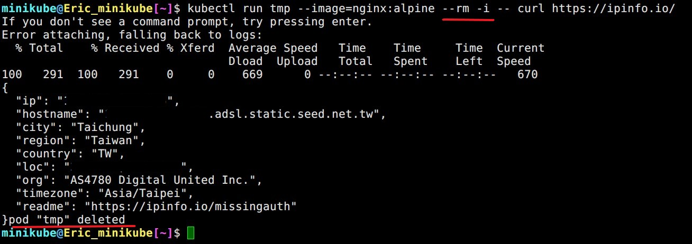

<br>

### 使用 `docker` 與 `podman`


大部分情況 `docker` 與 `podman` syntax 很接近~


```bash
## docker multi tags
sudo docker build -t registry.killer.sh:5000/sun-cipher:latest -t registry.killer.sh:5000/sun-cipher:v1-docker .

## pod man build image
podman build -t registry.killer.sh:5000/sun-cipher:v1-podman .

## podman run container
podman run -d --name sun-cipher registry.killer.sh:5000/sun-cipher:v1-podman

## podman show process
podman ps

## podman logs
podman logs sun-cipher
```

<br>

## Restart Deployment


```bash
kubectl rollout restart deployment my-nginx
```

<br>

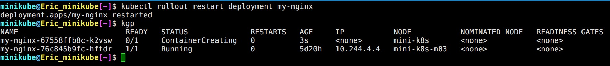

▲ `restart` 的方式是先產生一個新的 `pod` 再把舊的砍掉。

<br>

## `service` 除錯

<br>

**<span style='color:red'>`svc.spec.selector` 是指向 `pod` 的 labels 而不是 `Deployment` 的!!</span>**

<br>

