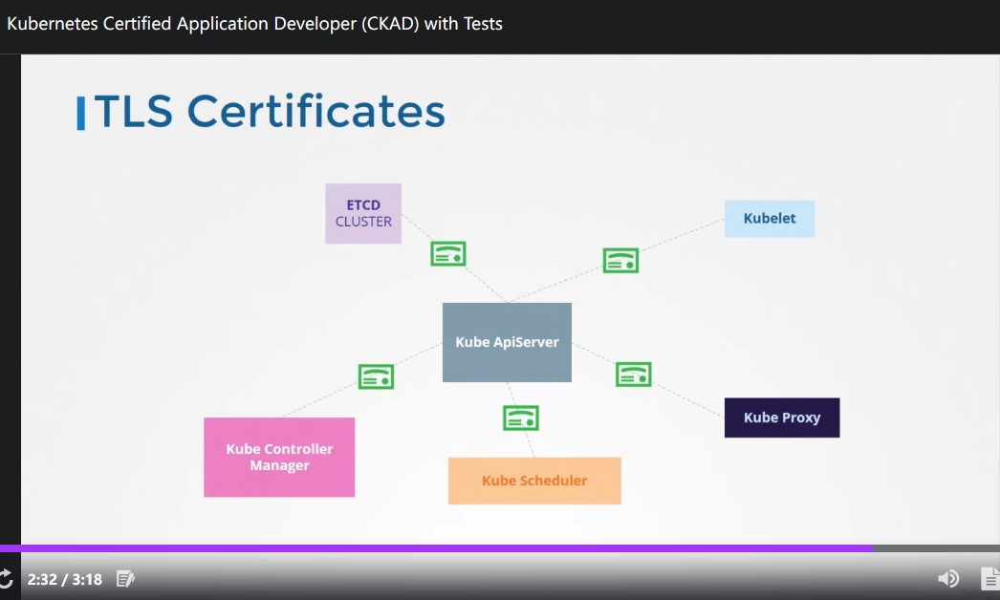
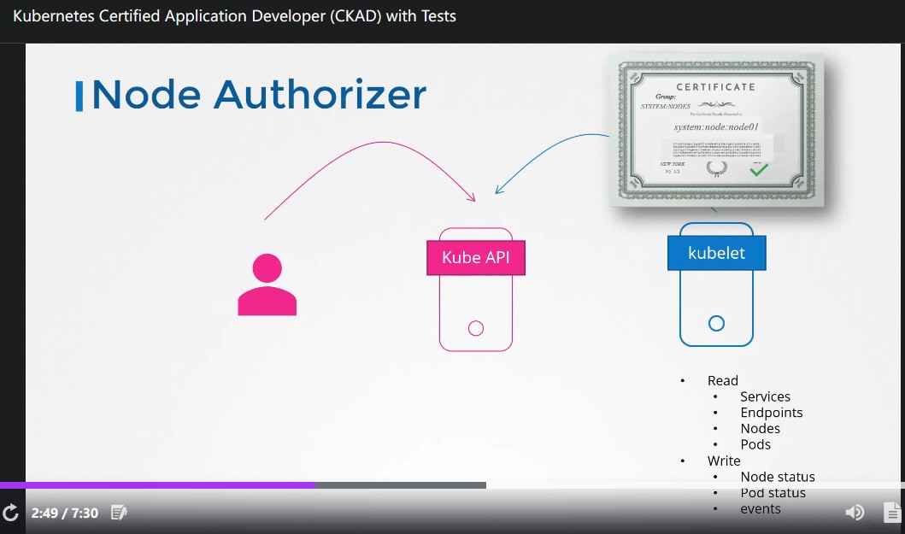

# CKAD Note Section 9 Updates for Sep 2021 Changes

<br>


▲ CKAD 新舊版差異

<br>

## 119. Define, build and modify container images

<br>

非常基礎的 Docker Image (container image) 介紹，我之前就打過一篇在公司 Bookstack 了~\
《Docker Image 介紹》

<br>

## 121. Authentication, Authorization and Admission Control

<br>

除了 master,worker node 本身的安全機制 (例如: SSH public key ONLY) 以外\
`kube-apiserver` 在 K8s cluster 當中扮演非常關鍵的角色必須要被嚴格控管，接下來的章節會介紹 How to\
一開始我們先來探討一下 **Who can access?** 與 **What can they do?**

<br>

### Who can access?


<br>


- Files - username and passwds
- Files - username and tokens
- Certification
- 外部授權平台 (例如: LDAP)
- Service Account

<br>

### What can they do?


~~其實我不知道中文怎麼翻.. What can they do ??~~  總之看起來像 K8s 的授權 (Authorization) 控管方式:


- RBAC Authorization. (Role Base Access Control)
- ABAC Authorization. (Attribute Base Access Control)
- Webhook Mode

<br>



▲ K8s cluster 內各個元件在溝通時都透過 TLS 加密

<br>

## 122. Authentication

<br>

本章節的重點會放在三種不同 user 如何透過 Authentication 機制安全的訪問 K8s cluster


- K8s cluster admin
- Developer
- ~~End User~~ (在這邊被移除，講師認為 sercurity 責任應該在 app 本身)
- Bots (service account)

<br>


▲ Kubernetes cluster 原始狀態並沒有提供使用者的功能

<br>


▲ 不管是透過 `kubectl` 或者 `curl` (不知道是不是就是在說 Dashboard) 都要找 `kube-apiserver`。首先會 (1) Authenticate Users (2) Process request。

<br>


驗證 (authentication) 的方式有這些:

- Static Password File
- Static Token File
- Certificates
- External service (EX: LDAP)

<br>

### File

前兩項都是以 file 的形式去給定使用者帳號跟密碼。 **<span style='color:red'>兩種都不建議使用</span>**


```csv
## <passwd>,<username>,<user_id>,<group_name>
password123,user1,u0001
```

<br>


▲ 然後在啟動 `kube-apiserver` 的時候傳進去

<br>


▲ `curl` 搭配 user/passwd 的認證方式

<br>


▲ `token` 的部分

<br>

## 123. KubeConfig

<br>


▲ 正常來說，透過 `kubectl` 或者 `curl` 來取得 `pod` 的資訊，指令應該長這樣。\
**<span style='color:blue'>因為使用起來太麻煩了，我們會把這些資訊放在 KubeConfig file  (`$HOME/.kube/config`) 裡面</span>**

<br>


▲ config file 裡面包含三個東西: `Cluster`, `Context`, `Users`。而 `Context` 就是串連 `Cluster` 與 `User` 的東西。\
其實這東西在前面章節的 LAB 就應該要接觸到了 (我記得我的筆記也有打) `kubectl config set-context --current --namespace=` 有印象了吧!

<br>


▲ config file 內容是 `YAML` 檔

<br>


▲ 使用 `kubectl config use-context <context_name>` 來切換。

<br>

## 125. API Groups

<br>

一直以來 `kubectl` 都是在跟 `api-server` 互動，這個章節要講的是 API Groups。\
接下來的動作會需要使用 `curl` 跟 `api-server` 互動，達成這個需求最簡單的方式就是使用 `kubectl proxy` 在 localhost 幫我們扮演一個 reverse proxy 的角色，這樣一來就能很簡單的使用 `curl` 不會複雜!


[Access Clusters Using the Kubernetes API](https://kubernetes.io/docs/tasks/administer-cluster/access-cluster-api/)


```bash
## run proxy in bg
kubectl proxy --port=8080 &

## bg -> fg
fg

## show bg jobs
jobs
```


```bash
curl http://localhost:8080/api/
```

<br>


▲ 列出 `api-server` 的 IP address

<br>


▲ 列出所有選項

<br>


▲ 一頁式 `api` page 能夠很清楚的知道各個 K8s Object 屬於哪個 API Group

<br>


▲ 每個 `Resources` 底下的都有 `Verbs` (動作)

<br>

## 126. Authorization

<br>


▲ 本章節目的很簡單，**權限區分**。根據不同使用者給予不同權限

<br>

### Authorization Mode 列表如下:


- AlwaysAllow
- Node
- ABAC
- RBAC
- WebHook
- AlwaysDeny

<br>

#### Node Authorizer


Node Authorizer 是專門給 worker node 與 `api-server` 之間溝通使用。

<br>



▲ `kubelet` 必須在 `SYSTEM:NODES` group 裡面 (使用 certification)。

<br>

#### ABAC Authorizer


全名: Attribute Base Access Control\
針對每個 user 設定權限 (1:1 關係)

<br>


▲ 每一次 新增/刪除 都需要重啟 `api-server`。很麻煩，所以有了 RBAC

<br>

#### RBAC Authorizer


全名: Role Base Access Control

<br>


<br>

#### WebHook Authorizer


<br>


▲ 其實不難懂，就是透過 webhook 去請外部 server 授權

<br>


▲ `api-server` 預設使用 `AlwaysAllow`

<br>


▲ 講師建議的配置，會依序授權。授權失敗往下一個，授權成功返回。

<br>

## 127. Role Based Access Controls

<br>

建立 `Role` 的方式很簡單，只需要記住 **<span style='color:red'>`--resources=` 與 `--verb=`</span>** 即可。


```bash
kubectl create role role-test --resource=pod --verb=get --verb=list --verb=watch --dry-run=client -o yaml
```

可以看到 `pod` 自動變成 `pods` 了! 由於 `resource pod` 屬於 `core api` 所以 `.rules.apiGroups[]` 可以是空白。

```yaml
apiVersion: rbac.authorization.k8s.io/v1
kind: Role
metadata:
  creationTimestamp: null
  name: role-test
rules:
- apiGroups:
  - ""
  resources:
  - pods
  verbs:
  - get
  - list
  - watch
```

<br>


▲ 透過指定 `--resource-name` 可以指定對象。

<br>

接著我們要把 `Role` 綁到 user 身上 => rolebinding


只需要記住 **<span style='color:red'>`--role=` 與 `--user=`</span>** 即可。


```bash
kubectl create rolebinding rb-test --role=role-test --user=beta --dry-run=client -o yaml
```


```yaml
apiVersion: rbac.authorization.k8s.io/v1
kind: RoleBinding
metadata:
  creationTimestamp: null
  name: rb-test
roleRef:
  apiGroup: rbac.authorization.k8s.io
  kind: Role
  name: role-test
subjects:
- apiGroup: rbac.authorization.k8s.io
  kind: User
  name: beta
```

<br>

### 測試權限


```bash
kubectl auth can-i create pod
kubectl auth can-i delete deployment
kubectl auth can-i get service

## as user
kubectl auth can-i create pod --as=beta
kubectl auth can-i delete deployment --as=beta
kubectl auth can-i get service --as=beta

## particular namespace
kubectl auth can-i create pod --as=beta --namespace=say-my
kubectl auth can-i delete deployment --as=beta --namespace=say-my
kubectl auth can-i get service --as=beta --namespace=say-my
```

<br>

## 128. Cluster Roles

<br>


▲ 首先要先介紹 namespace **<span style='color:red'>ed</span>** 與 Cluster scope 旗下物件的差異。

<br>


▲ `kubectl api-resources --namespaced` 可以列出需要 `namespace` 的 K8s resource。\
反之 `kubectl api-resources --namespaced=false`

<br>


▲ 舉例: 使用 `clusterrole` 讓 cluster-admin 可以管理 worker-node。**<span style='color:red'>不過 clusterrole 並沒有限定 `resource` 只能是 `namespaced == false` 的物件! 當使用者使用 `clusterrole` 建立 `resource == pod` 的 RBAC 時，等於 `namespace == 所有 K8s cluster 內的 namespace`</span>。**

<br>


▲ K8s cluster 已經內建許多 `clusterrole`

<br>